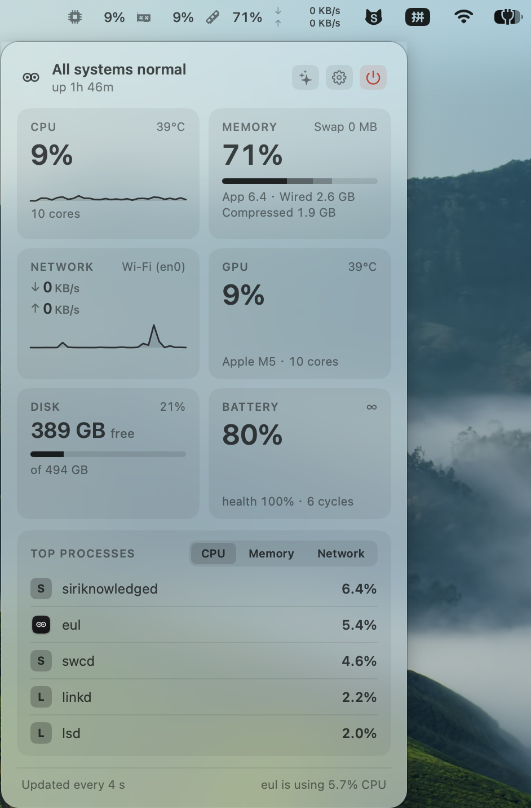

<p align="center">
  
</p>

# eul 2.2

A calm system monitor for the macOS menu bar — this fork revives and redesigns [gao-sun/eul](https://github.com/gao-sun/eul) for modern macOS and Apple Silicon, rebuilt around one idea: **glanceable when things are fine, useful when they aren't.**

<p align="center">
  
</p>

## Highlights

- **One entry point in the bar.** Your pinned metrics render as a single strip; when the menu bar gets crowded, a width governor collapses it slot by slot down to the eyes — eul never silently disappears.
- **An investigation panel, not a dropdown.** Click the strip for a top-down read: verdict, metric tiles with sparklines, top processes by CPU / memory / network, and eul's own footprint reported on every open.
- **A health engine instead of a Christmas tree.** Surfaces stay monochrome until a *sustained* signal trips — thermal pressure, memory pressure, disk almost full, runaway process — then exactly the responsible metric tints amber or red, in the bar and in the panel.
- **Fan control with a real safety model.** A privileged helper (macOS 13+, approved by you in System Settings) drives the fans: linked by default with one stepped slider, Auto / Manual / Boost per fan if you unlink. Targets are clamped to hardware limits, macOS can always cool past your setting, and fans revert to Auto whenever eul isn't running — enforced by the helper's own dead-man watchdog, not by good intentions.
- **Honest widgets.** Battery, CPU, Memory, Network, Health, and Trends widgets, each stating how old its data is instead of pretending to be live.
- **Native sampling.** Process lists, CPU, memory, disk, GPU, battery, and temperatures all come from syscalls and I/O Kit. The two readings macOS exposes only through a command — `nettop` for per-process network and `system_profiler` for Bluetooth — are gated to the panel, so they never run in the background. Container writes and widget reloads are skipped when nothing consumes them, and refresh cadence (1–10 s) is one slider with its energy cost stated next to it.
- **Personalization without a layout editor.** Hide tiles you don't care about (right-click), value-only bar slots, °C/°F and MB/s ⇄ Mb/s units, 23 languages.

## Requirements

| | Minimum |
|---|---|
| App and widgets | macOS 12 (Monterey) |
| Fan control | macOS 13 (Ventura), and a build signed with a real team |
| Architecture | Universal — Apple Silicon and Intel |
| Toolchain to build | Xcode 27 (verified against SDK 27.0) |

The macOS 12 floor is not a design choice: Xcode 27 no longer accepts an 11.0 deployment target, so the app, the widgets, and the shared framework all build at 12.0.

Fan control is the one feature that needs more than a build from source. macOS validates signatures before registering a privileged helper, so the helper only installs from a properly signed app. Everything else runs fine unsigned.

## How eul reads your Mac

No figure is inferred, guessed, or copied from Activity Monitor. Each one comes from a stated source, read at a stated cadence.

| Reading | Source | When |
|---|---|---|
| CPU usage, load average, uptime, per-core breakdown | `host_processor_info`, `sysctl` | each refresh tick |
| Per-process CPU and memory | `proc_listallpids` + `proc_pidinfo` (`PROC_PIDTASKINFO`) | panel open on the CPU or memory lens |
| Memory breakdown, swap | host statistics, `sysctl vm.swapusage` | each refresh tick |
| Disk space | `FileManager` volume values, `statfs` per mounted volume | while DISK is pinned or the panel is open |
| Disk applications / system data | measured — see below | once per app run, when the DISK tile is expanded |
| GPU usage and clocks | I/O Kit `IOAccelerator` `PerformanceStatistics` | while GPU is pinned or the panel is open |
| GPU model and core count | `system_profiler` | once per launch |
| Battery charge, condition, power source | `IOPSCopyPowerSourcesInfo`, filtered to the internal pack | each refresh tick |
| Battery capacities and cycle count | I/O Kit `AppleSmartBattery` | each refresh tick |
| Temperatures | SMC keys, plus IOHID PMU sensors on Apple Silicon | each refresh tick |
| Fan speeds | SMC keys | each refresh tick |
| Network throughput | `sysctl` interface counters | each refresh tick |
| Network per-process | `nettop` | panel open on the network lens |
| Bluetooth device batteries | `system_profiler` | when the panel opens |

One process walk feeds both the panel's lists and the runaway detector (`IOHelper.processSamples()`), so a single place knows how to walk pids and how to turn the kernel's mach ticks into seconds.

The boot-volume capacity query is an XPC round trip measured at ~4.7 ms, so it is cached for 60 s rather than paid every tick.

### The disk split is measured, not reported

macOS keeps its Storage breakdown (Applications, System Data, Documents, …) in a private daemon with no public API. eul therefore measures what it can and labels the rest honestly:

- **Applications** — the allocated size of `/Applications`, walked once per app run on a background queue.
- **System Data** — the volume's used space minus the measured applications, clamped at zero.

So the two figures always add up to the used figure eul displays, but System Data is a residual, not the number System Settings would show.

## Honesty over reassurance

- **Absent, never empty.** A tile for hardware you don't have is not rendered at all: no battery tile on a Mac without a battery, no fan tile on a Mac without fans.
- **Unknown, never invented.** Battery health prints `N/A` and an unavailable capacity prints `—`, rather than a plausible-looking zero. A sensor that fails three times without ever succeeding is dropped instead of displayed as 0 — and a sensor that has read correctly once is kept through a bad patch instead of being dropped for the session.
- **Sustained, never instant.** Colour is driven by a debounced engine — thermal pressure, memory pressure, a boot disk under 10% or 15 GB, or one process above 150% of a core for 2 minutes. A momentary spike never repaints the bar.
- **`top`-compatible CPU numbers.** Per-process CPU keeps the core-equivalent scale (1.0 = one core), so a process using two cores reads 200%, matching `top`.

## macOS 26 / 27

macOS 26/27 moved the battery hardware values. The raw capacities left the `AppleSmartBattery` service's top level and now live in a nested `BatteryData` dictionary, leaving only percentages at the top. Reading the documented keys in order therefore returned `MaxCapacity = 100` — a percentage — while the design capacity read as missing, so the app reported "100 mAh / 0 mAh" and an `N/A` health figure. eul now merges the property tree, including the nested dictionaries and the pack/bank/cell entries, and rejects any capacity at or below 100 as a percentage rather than milliampere-hours.

Two further notes for this generation of macOS:

- **Deployment target.** Xcode 27 dropped the 11.0 target; the project builds at 12.0. See Requirements.
- **SMC sensors.** Apple Silicon exposes no CPU/GPU temperature or `FNum` key, so those probes are skipped rather than surfaced as an initialisation failure. Temperatures come from the IOHID PMU sensors, and fans from SMC where the machine has them.

## Installation

### Download

Download [`eul.app.zip` from the latest release](https://github.com/chrsomle/eul/releases/latest/download/eul.app.zip), unzip, and drag `eul.app` into `/Applications`.

The release build is development-signed, not notarized — on first launch macOS will balk: right-click `eul.app` → **Open** (or allow it under System Settings → Privacy & Security). Fan control is unavailable in this build, for the reason given in Requirements.

### Build from source

```bash
git clone https://github.com/chrsomle/eul.git && cd eul

xcodebuild -scheme eul -project ./eul.xcodeproj -sdk macosx -configuration Release build \
  CODE_SIGN_STYLE=Automatic DEVELOPMENT_TEAM=<your team id> -allowProvisioningUpdates
```

Copy the built `eul.app` from DerivedData into `/Applications`. A signing team (a free Apple Developer account works) is required for fan control — macOS refuses to register the privileged helper from an unsigned app. Everything else runs fine unsigned:

```bash
xcodebuild -scheme eul -project ./eul.xcodeproj -sdk macosx build \
  CODE_SIGN_IDENTITY="" CODE_SIGNING_REQUIRED="NO" \
  CODE_SIGN_ENTITLEMENTS="" CODE_SIGNING_ALLOWED="NO"
```

## Project layout

```
eul/              the app — sampling stores, views, the status bar, preferences
SharedLibrary/    schema shared by the app and the widgets, plus the units engine
BatteryWidget/    per-metric widgets, each a small SwiftUI view over a shared entry
CpuWidget/
MemoryWidget/
NetworkWidget/
EulWidgets/       the Health and Trends widgets
FanHelper/        the privileged fan helper, driven over XPC
SelfUpdate/       the relaunch-into-place helper the updater uses
Resource/         the 23 localizations and the asset catalog
design/           handoff specs, screenshots, and the icon generator
BuildTools/       the pinned SwiftFormat build used by the lint phase
```

Sampling lives in `eul/Store/`: one store per metric, each an `ObservableObject` that reads its source on a tick and publishes the result. A store is only started when something consumes it — the panel's process lenses and the `nettop` collector run only while the panel is open on that lens.

## Development

SwiftUI throughout, no test target — CI builds and lint-checks formatting. Run the formatter before committing:

```bash
cd BuildTools && swift run -c release swiftformat ../ --lint   # check
cd BuildTools && swift run -c release swiftformat ..           # fix
```

The design direction and component specs live in [`design/handoff`](design/handoff). The app icon is generated from code: [`design/icon/generate-appicon.swift`](design/icon/generate-appicon.swift).

Sources are listed explicitly in the project file, so a new file under `eul/` must also be added to `eul.xcodeproj`.

## Acknowledgements

eul was created by [gao-sun](https://github.com/gao-sun) — this fork stands on that work and keeps its localization community's contributions.

<!-- ALL-CONTRIBUTORS-LIST:START - Do not remove or modify this section -->
<!-- prettier-ignore-start -->
<!-- markdownlint-disable -->
<table>
  <tr>
    <td align="center"><a href="https://github.com/XaoflySho"><br /><sub><b>XaoflySho</b></sub></a><br /><a href="https://github.com/gao-sun/eul/commits?author=XaoflySho" title="Code">💻</a></td>
    <td align="center"><a href="https://github.com/akeschmidi"><br /><sub><b>akeschmidi</b></sub></a><br /><a href="#translation-akeschmidi" title="Translation">🌍</a></td>
    <td align="center"><a href="http://artkost.ru/"><br /><sub><b>Nikolay Kostyurin</b></sub></a><br /><a href="#translation-JiLiZART" title="Translation">🌍</a></td>
    <td align="center"><a href="http://jesusm.github.io/"><br /><sub><b>Jesus</b></sub></a><br /><a href="#translation-JesusM" title="Translation">🌍</a></td>
    <td align="center"><a href="https://github.com/kant"><br /><sub><b>Darío Hereñú</b></sub></a><br /><a href="#translation-kant" title="Translation">🌍</a></td>
    <td align="center"><a href="http://opensource.generali-cloud.net/"><br /><sub><b>R. Fuehrer</b></sub></a><br /><a href="#translation-rfuehrer" title="Translation">🌍</a></td>
  </tr>
  <tr>
    <td align="center"><a href="https://github.com/jorgeclaro"><br /><sub><b>Jorge Claro</b></sub></a><br /><a href="#translation-jorgeclaro" title="Translation">🌍</a></td>
    <td align="center"><a href="https://medium.com/@zorig"><br /><sub><b>Zorig</b></sub></a><br /><a href="#translation-Zorig" title="Translation">🌍</a></td>
    <td align="center"><a href="https://github.com/lill74"><br /><sub><b>lill74</b></sub></a><br /><a href="#translation-lill74" title="Translation">🌍</a></td>
    <td align="center"><a href="https://github.com/strafe"><br /><sub><b>strafe</b></sub></a><br /><a href="#translation-strafe" title="Translation">🌍</a></td>
    <td align="center"><a href="https://github.com/AndyH0ng"><br /><sub><b>Andy Hong</b></sub></a><br /><a href="#translation-AndyH0ng" title="Translation">🌍</a></td>
    <td align="center"><a href="https://treastrain.jp/"><br /><sub><b>treastrain / Tanaka Ryoga</b></sub></a><br /><a href="#translation-treastrain" title="Translation">🌍</a></td>
  </tr>
  <tr>
    <td align="center"><a href="https://github.com/baptistecdr"><br /><sub><b>Baptiste C.</b></sub></a><br /><a href="#translation-baptistecdr" title="Translation">🌍</a></td>
    <td align="center"><a href="https://github.com/b3z"><br /><sub><b>Luca</b></sub></a><br /><a href="#translation-b3z" title="Translation">🌍</a></td>
    <td align="center"><a href="https://github.com/40uf411"><br /><sub><b>Ali AOUF &#124; علي عوف</b></sub></a><br /><a href="#translation-40uf411" title="Translation">🌍</a></td>
    <td align="center"><a href="https://github.com/sboh1214"><br /><sub><b>Seungbin Oh</b></sub></a><br /><a href="#translation-sboh1214" title="Translation">🌍</a></td>
    <td align="center"><a href="https://github.com/nrudnyk"><br /><sub><b>nrudnyk</b></sub></a><br /><a href="#translation-nrudnyk" title="Translation">🌍</a></td>
    <td align="center"><a href="https://github.com/kawarimidoll"><br /><sub><b>カワリミ人形</b></sub></a><br /><a href="https://github.com/gao-sun/eul/commits?author=kawarimidoll" title="Documentation">📖</a></td>
  </tr>
  <tr>
    <td align="center"><a href="https://github.com/ivyjsgit"><br /><sub><b>Ivy Jackson</b></sub></a><br /><a href="https://github.com/gao-sun/eul/commits?author=ivyjsgit" title="Code">💻</a></td>
    <td align="center"><a href="https://github.com/J-rg"><br /><sub><b>J-rg</b></sub></a><br /><a href="#translation-J-rg" title="Translation">🌍</a></td>
    <td align="center"><a href="https://github.com/jevonmao"><br /><sub><b>Jevon Mao</b></sub></a><br /><a href="https://github.com/gao-sun/eul/commits?author=jevonmao" title="Code">💻</a></td>
    <td align="center"><a href="https://github.com/Tekrific"><br /><sub><b>Tekrific</b></sub></a><br /><a href="#translation-Tekrific" title="Translation">🌍</a></td>
    <td align="center"><a href="https://github.com/nebeker"><br /><sub><b>nebeker</b></sub></a><br /><a href="#translation-nebeker" title="Translation">🌍</a></td>
    <td align="center"><a href="https://github.com/DMNerd"><br /><sub><b>Adam</b></sub></a><br /><a href="#translation-DMNerd" title="Translation">🌍</a></td>
  </tr>
  <tr>
    <td align="center"><a href="https://github.com/stosumarte"><br /><sub><b>stosumarte</b></sub></a><br /><a href="#translation-stosumarte" title="Translation">🌍</a></td>
    <td align="center"><a href="https://github.com/gnehs"><br /><sub><b>gnehs</b></sub></a><br /><a href="#translation-gnehs" title="Translation">🌍</a></td>
    <td align="center"><a href="https://github.com/Animenosekai"><br /><sub><b>Animenosekai</b></sub></a><br /><a href="#translation-Animenosekai" title="Translation">🌍</a></td>
    <td align="center"><a href="https://github.com/soewaiyanmyowin"><br /><sub><b>Soe Wai Yan Myo Win</b></sub></a><br /><a href="#translation-soewaiyanmyowin" title="Translation">🌍</a></td>
    <td align="center"><a href="http://www.studio83.cz/"><br /><sub><b>Vojtěch Kaizr</b></sub></a><br /><a href="#translation-wojtishek" title="Translation">🌍</a></td>
    <td align="center"><a href="https://github.com/thewqer"><br /><sub><b>wqer</b></sub></a><br /><a href="#translation-thewqer" title="Translation">🌍</a></td>
  </tr>
  <tr>
    <td align="center"><a href="https://github.com/sn0wmem0ry"><br /><sub><b>sn0wmem0ry</b></sub></a><br /><a href="#translation-sn0wmem0ry" title="Translation">🌍</a></td>
    <td align="center"><a href="https://github.com/daimajia"><br /><sub><b>代码家</b></sub></a><br /><a href="https://github.com/gao-sun/eul/commits?author=daimajia" title="Code">💻</a></td>
    <td align="center"><a href="https://github.com/bitigchi"><br /><sub><b>Emir Sarı</b></sub></a><br /><a href="#translation-bitigchi" title="Translation">🌍</a></td>
  </tr>
</table>

<!-- markdownlint-restore -->
<!-- prettier-ignore-end -->

<!-- ALL-CONTRIBUTORS-LIST:END -->

## Language Support

```swift
let languages = [
  "简体中文", "English", "العربية",
  "Deutsch", "Русский", "Español",
  "Português", "Монгол", "한국어",
  "日本語", "Français", "Українська",
  "Svenska", "Čeština", "Italiano",
  "繁體中文", "မြန်မာဘာသာ", "Magyar",
  "ไทย", "Türkçe", "فارسی",
  "Polski", "Dansk",
];
```
